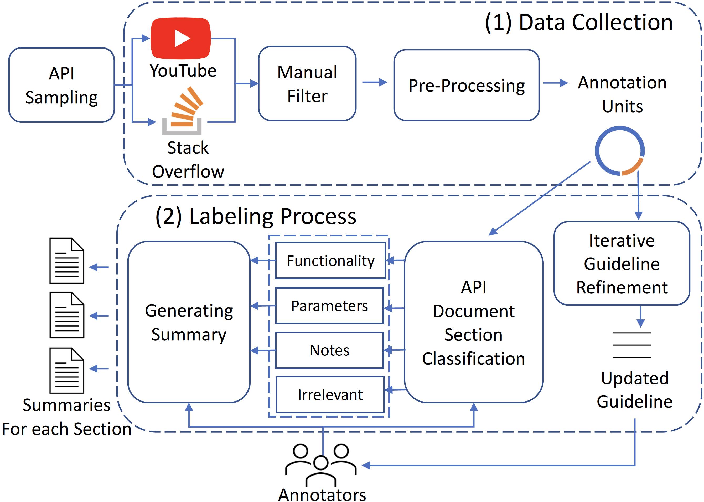

# Intro
This repository contains the code and summarization benchmark for APIDocBooster.

# Overview
We construct the first benchmark named APISumBench for augmenting API documentation from multi sources.
We also propose APIDocBooster, a novel solution to automatically augment each section of API documentation by generating complementary summaries from multiple sources.
The following figure is an illustration of our approach's pipeline.


# Benchmark

## Overview
APISumBench has two-phases data. 
The first phase data consists of sentences labeled with API documentation sections or irrelevant to the API. 
The second stage data consist of summaries for augmenting API documentation, each of which is created from the first stage data.

<center>
<figure>
<!--  
 -->

</figure>
</center>

For more information, please kindly read [this instruction](data/readme.md).

# Getting Started with APIDocBooster

## Environment Setting

Please create a python vitural environment for running APIDocBooster by using the configuration file:

```
packenvironment.yml 
```

## Rouge Setting

To set the ROUGE evaluation, please follow [this instruction](https://stackoverflow.com/a/57686103/10143020).

## Running the pipeline

We provide our proposed tool APIDocBooster. 
To use this tool, firstly you're required to train the transformer model for the classification task. 
You can also fine-tune the model with your own data.
Please refer to our code in the ``src/classification``.

Then please kindly refer to our code in 
```
src/extractive_summarization/our_approach/upsum/src/biased_summarization.py
```
for extractive summarization stage, which generates extractive summaries for each API documentation.

Finally, please kindly refer to our code in 
```
/storage/chengran/tosem_submission_api_doc/APISUM_replication/src/abstractive_summarization/call.py
```
for abstractive summarization stage, which generates abstractive summaries for each API documentation. 
Note that, to use our abstractive summarization script, please kindly register an OpenAI key and replace the key content in the script. 

